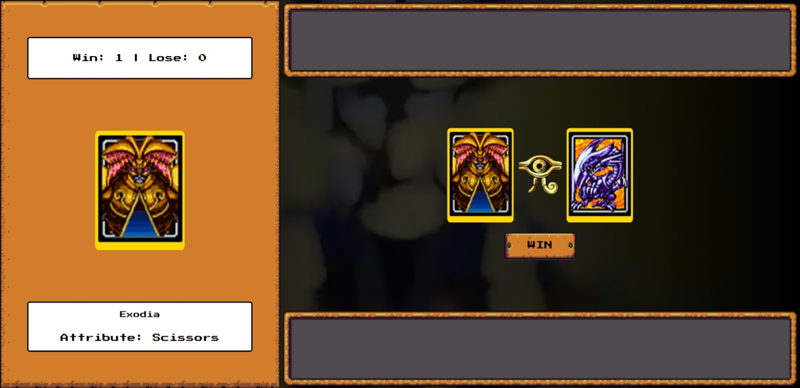

# Yu-Gi-Oh | Jo-ken-po Edition

## Descrição do Projeto

O projeto **Yu-Gi-Oh | Jo-ken-po Edition** é um jogo de cartas inspirado no famoso jogo de cartas Yu-Gi-Oh, com uma singularidade distinta, ele adota as normas do tradicional Jo-ken-po. Os jogadores confrontam-se utilizando cartas que retratam personagens distintos, cada um vinculado a uma habilidade única (pedra, papel ou tesoura). A meta consiste em derrotar o oponente conforme as dinâmicas de pedra-papel-tesoura.

## Como Jogar

- Cinco cartas são distribuídas para cada jogador.

- O jogador escolhe uma carta ao clicar sobre ela, iniciando o duelo.

- Após a escolha do jogador, as cartas são reveladas, e o resultado do duelo é determinado.

- O placar é atualizado com base nos resultados dos duelos.

- Ao clicar no botão, com o resutado do duelo anterior, o jogo é reiniciado com novas cartas para um novo confronto.

## Estrutura do Projeto

O projeto é dividido em alguns módulos:

- **uiManipulation.js:** Manipulação da interface do usuário, incluindo funções para desenhar cartas, ocultar elementos e atualizar sprites.
- **card.js:** Definição dos dados das cartas, geração aleatória de cartas e criação de elementos de imagem para as cartas.
- **audio.js:** Reprodução de efeitos sonoros durante o jogo.
- **gameLogic.js:** Lógica do jogo, incluindo a verificação dos resultados do duelo e a configuração do campo de jogo.

## Requisitos e Configurações

- Certifique-se de ter o áudio habilitado para uma experiência completa.
- As imagens das cartas estão localizadas na pasta [icons](./src/assets/icons).
- Abra o arquivo "index.html" para iniciar o jogo no navegador.

Divirta-se duelando no mundo único de [Yu-Gi-Oh | Jo-ken-po Edition](https://yugioh-jo-ken-po-edition.vercel.app/)!
